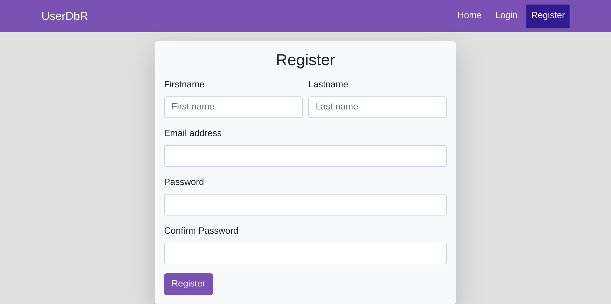
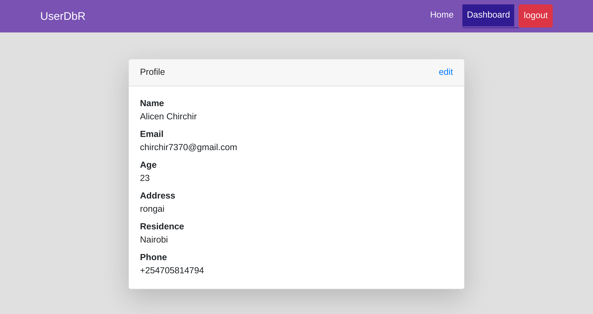
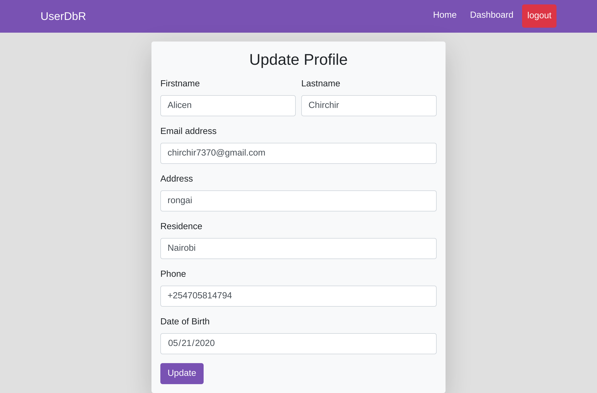

# FULLSTACK REACT APP WITH AUTHENTICATION USING REACT AND NODE JS

## Achievements

- create a restful application using node express
- undestand how one-to-one relationship works
- understand how to authenticate users using JWT
- understand how to encrypt password using bcrypt
- use sequelize to manage databases
- create client side application that consumes a restful api
- work with -sequelize-cli
- work with react router
- how to use react redirect to redirect user based on their login status
- how to work with authentication in react

## how it works

- register with the system
- login
- update profile

## screenshots

### register

### dashboard

### update

## end points

- create user
  - `/api/auth/register`
- log user in
  - `/api/auth/login`
- update profile
  - `/api/profile/update`
- get profile
  - `/api/userprofile`

## Author

##### follow me on

- Github: [@githubhandle](https://github.com/chirchir12)
- Twitter: [@twitterhandle](https://twitter.com/shadochir)
- Linkedin: [linkedin](https://www.linkedin.com/in/emmanuel-chirchir/)
- Email: [email](chirchir7370@gmail.com)

## Technologies used

### backend

1. nodejs
2. express
3. sequelize
4. sequelize-cli
5. JWT
6. Bcrypt
7. MYSQL
8. javaScript

### frontend

1. React
2. Contect API
3. Hooks
4. HTML5
5. CSS3
6. React Router
7. localStorage
8. Redirect

## Contributions, issues and feature requests are welcome!

Feel free to check the [issues page](issues/).

## Show your support

Give a ⭐️ if you like this project!
