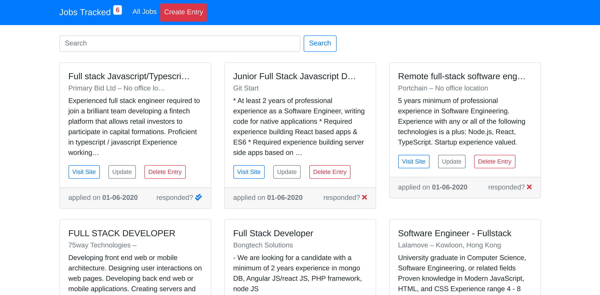
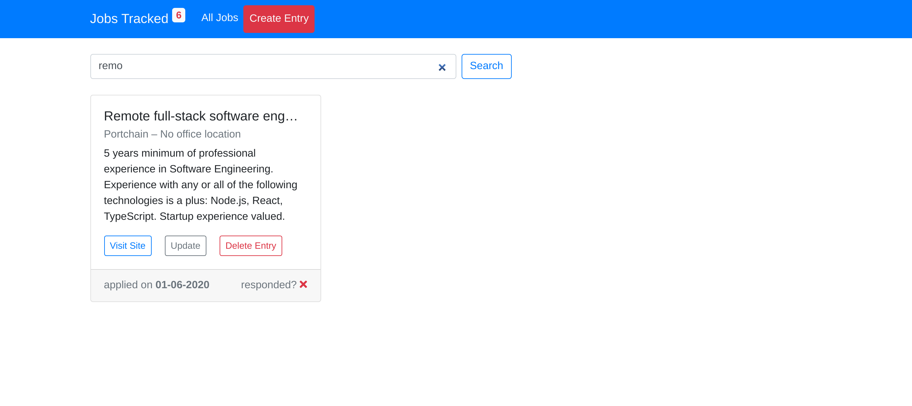
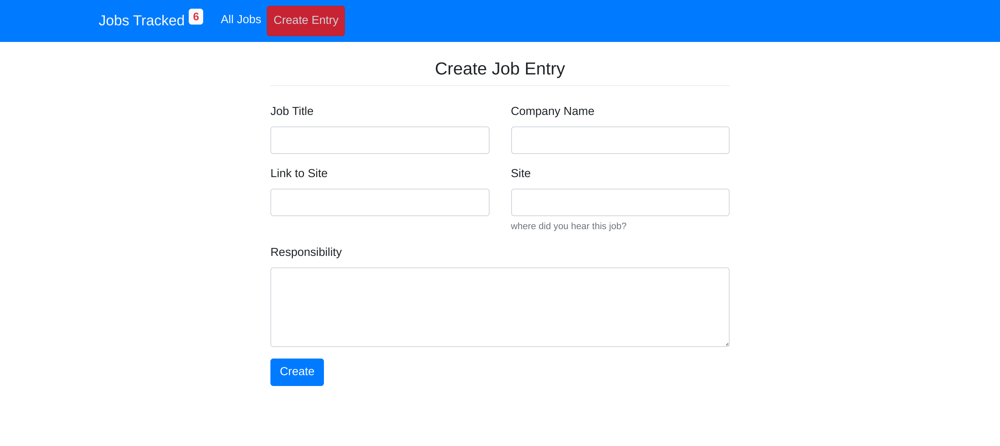

# JOB TRACKER USING REACT AND NODE JS

this is a simple project to enable you keep track of all the jobs you have applied.

## Goals & Achievements

- create a restful application using node express
- use sequelize to manage databases
- form validation and error handling
- search functionality to search job entry based on the title
- create client side application that consumes a restful api
- work with -sequelize-cli
- work with react router

## getting started

1. clone repo
2. cd to jobTracker
3. cd to backend and run `nodemon server'
4. cd to client and run `npm start`

## Author Info

##### follow me on

- Github: [@githubhandle](https://github.com/chirchir12)
- Twitter: [@twitterhandle](https://twitter.com/shadochir)
- Linkedin: [linkedin](https://www.linkedin.com/in/emmanuel-chirchir/)
- Email: [email](chirchir7370@gmail.com)

## screenshots

### List of jobs

### Search List

### Update

### Create

## end points

###### Jobs

- create job
  - `/api/jobs/create`
- update job
  - `/api/jobs/update/:id`
  - delete problems
  - `/api/jobs/delete/:id`
- get jobs
  - `/api/jobs`
- update response jobs

- `/api/jobs/response/:id`

## Technologies used

### backend

1. nodejs
2. express
3. sequelize
4. sequelize-cli
5. MYSQL
6. javaScript

### frontend

1. React
2. Contect API
3. Hooks
4. HTML5
5. CSS3
6. React Router

## Contributions, issues and feature requests are welcome!

Feel free to check the [issues page](issues/).

## Show your support

Give a ⭐️ if you like this project!
